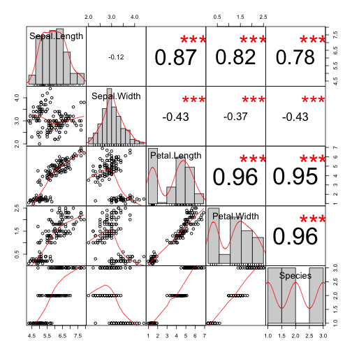

Fitting Generalized Linear Models
========================================================
author: Alexander Makeev
date: 11/22/2015
Coursera Developing Data Products Course Project


Main Features
========================================================
<a href=https://santyagoseaman.shinyapps.io/DevelopingDataProductsCourseProject>Great application</a> which make incredible fitting of GLM model

- Easy to interact
- Ability to select predictors list
- Ability to change predictors interaction

Just look at this beautiful data
========================================================


```r
summary(iris)
```

```
  Sepal.Length    Sepal.Width     Petal.Length    Petal.Width   
 Min.   :4.300   Min.   :2.000   Min.   :1.000   Min.   :0.100  
 1st Qu.:5.100   1st Qu.:2.800   1st Qu.:1.600   1st Qu.:0.300  
 Median :5.800   Median :3.000   Median :4.350   Median :1.300  
 Mean   :5.843   Mean   :3.057   Mean   :3.758   Mean   :1.199  
 3rd Qu.:6.400   3rd Qu.:3.300   3rd Qu.:5.100   3rd Qu.:1.800  
 Max.   :7.900   Max.   :4.400   Max.   :6.900   Max.   :2.500  
       Species  
 setosa    :50  
 versicolor:50  
 virginica :50  
                
                
                
```

We make very complex calculations...
========================================================


```r
model <- glm(Species ~ ., iris, family="binomial")
```

```

Call:  glm(formula = Species ~ ., family = "binomial", data = iris)

Coefficients:
 (Intercept)  Sepal.Length   Sepal.Width  Petal.Length   Petal.Width  
      16.946       -11.759        -7.842        20.088        21.608  

Degrees of Freedom: 149 Total (i.e. Null);  145 Residual
Null Deviance:	    191 
Residual Deviance: 3.294e-09 	AIC: 10
```

To show you unbelievable charts
========================================================

 
